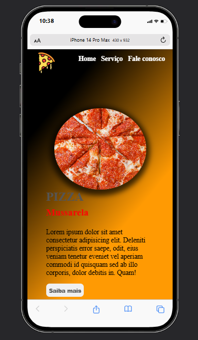

# 🍕 Landing Page de Pizzaria

## Sobre 🤓
Uma landing page simples desenvolvida para uma pizzaria, criada com o objetivo de aplicar e reforçar os conhecimentos adquiridos em HTML e CSS.

## 📝 Descrição
Este projeto consiste em uma página inicial visualmente atrativa, com um design minimalista e funcional. Ele foi pensado para:

- Simular uma interface de apresentação para uma pizzaria.

- Praticar e consolidar habilidades de HTML semântico e estilização com CSS.

- Servir como base para futuras melhorias e integrações com JavaScript

## Tecnologias 🛠️

- HTML
- CSS